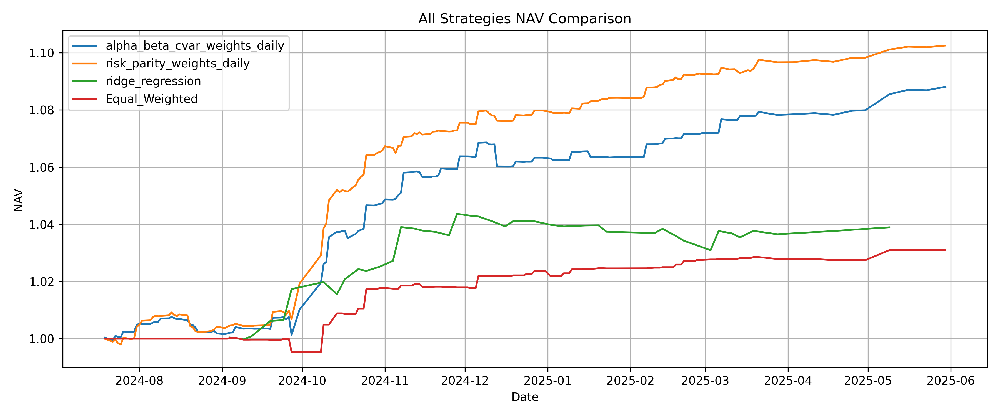
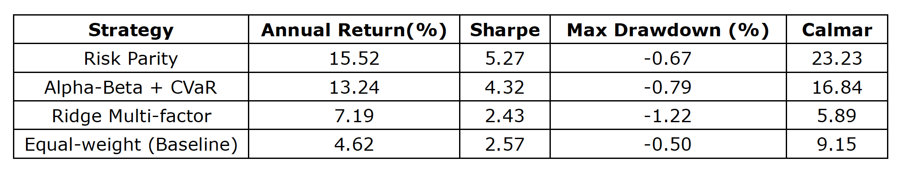

## Project Overview
This model focuses on the design and implementation of a `multi-strategy fund-of-funds (FOF) portfolio optimization framework` that combines machine learning-based return forecasting with various weighting strategies.

I developed a `rolling forecasting and backtesting system` using `XGBoost regression` to predict fund returns, combined with multiple portfolio allocation approaches:
- `Static strategies`: Risk Parity, Alpha-Beta + CVaR, Equal-Weighted baseline
- `Dynamic strategy`: Ridge multi-factor regression, combining predicted returns (μ) with multiple risk metrics (annualized volatility, conditional value-at-risk (CVaR), maximum drawdown, market correlation)

I also implemented the `entire pipeline`, including:
- Rolling window model training
- Daily weight generation
- Sharpe ratio & drawdown evaluation
- Turnover calculation & transaction cost handling
- Out-of-sample backtesting with performance visualization

---

## Features

- `XGBoost-based rolling return forecasting`
- `Multi-factor risk profiling` using volatility, CVaR, drawdown, and market correlation
- `Multiple portfolio strategies`
    - Risk Parity
    - Alpha-Beta + CVaR
    - Ridge multi-factor regression (dynamic allocation)
    - Equal-weight baseline 
- `Realistic transaction simulation` (turnover & cost)
- Fully parameterized pipeline (holding period, lookback window)
- Fast computation with pandas & numpy

---

## Module Justification

### `data_handle.py`
- Loads and cleans raw fund NAV data
- Computes daily log returns for all funds
- Generates equal-weight benchmark returns for Alpha/Beta regression

### `build_xgb_dataset.py`
- Constructs feature matrix from historical fund returns
- Includes momentum (`mom_5`, `mom_10`), volatility (`volatility_20`), drawdown (`mdd_20`), CVaR (cvar_20), and correlation (`corr_20`)
- Generates multi-factor risk profiles for each fund on each date

### `train_xgb_models.py`
- Implements rolling-window `XGBoost regression` models to predict fund returns over the next `holding_window` days
- Saves predicted return matrix for allocation

### `fof_combination.py`
- Generates portfolio weights for multiple strategies:
    - `Risk Parity`: Inverse volatility weighting
    - `Alpha-Beta + CVaR`: Combines intercept and inverse beta from return-vs-benchmark regression, filtered by CVaR
    - `Ridge Multi-factor Regression`: Learns optimal weights from predicted returns and risk factors using Ridge regression
- Saves portfolio weights for backtesting

### `fof_backtest.py`
- Runs backtests for all strategies using historical returns and generated weights
- Computes performance metrics:
    - `Annualized return`
    - `Sharpe ratio`
    - `Max drawdown`
    - `Calmar ratio`
- Plots NAV curves for strategy comparison
- Calculates turnover and transaction costs

---

## Example Output

- All Strategies NAV Comparison
    
- Performance Metrics Example
    

---

## Requirements

- Python >= 3.8
- pandas
- numpy
- scikit-learn
- xgboost
- matplotlib
